<div align="center">

<div align="center">

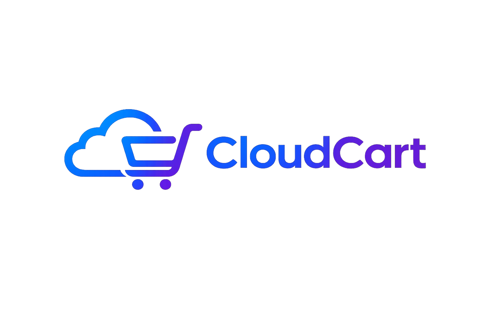

# CloudCart – Production-Grade E-Commerce Platform on AWS

</div>

### Production-Ready AWS Infrastructure | Terraform IaC | Docker | GitHub Actions CI/CD | CloudFront | Auto Scaling | Monitoring

[](https://aws.amazon.com/)
[](https://www.terraform.io/)
[](https://www.docker.com/)
[](https://github.com/features/actions)
[](https://www.python.org/)
[](https://aws.amazon.com/cloudfront/)
[](LICENSE)

_A production-grade AWS cloud infrastructure project demonstrating modern Infrastructure as Code (IaC), scalable application deployment, automated CI/CD pipelines, and cloud monitoring using AWS best practices._

</div>

---

# 📖 Project Overview

CloudCart is a **production-grade AWS cloud infrastructure project** built to demonstrate how a modern e-commerce application can be deployed, automated, monitored, and managed using AWS services and Infrastructure as Code.

Unlike a traditional Flask application project, this repository focuses on designing and deploying a **highly available**, **scalable**, and **maintainable** cloud infrastructure that follows real-world engineering practices used in production environments.

The application is containerized using Docker, deployed on Amazon EC2 instances managed by an Auto Scaling Group, distributed globally through Amazon CloudFront, and fully provisioned using Terraform modules. Infrastructure provisioning, application deployment, and infrastructure lifecycle management are automated through GitHub Actions workflows.

This project demonstrates practical experience with:

- Designing production-style AWS architectures
- Infrastructure as Code using Terraform
- Docker-based application deployment
- Continuous Integration and Continuous Deployment (CI/CD)
- Cloud monitoring and alerting
- Infrastructure automation
- Secure networking
- Production deployment workflows

---

# 🌐 Live Demo

| Resource                      | URL                                          |
| ----------------------------- | -------------------------------------------- |
| **CloudCart Application**     | https://cloudcart.betterway.cloud            |
| **Application Documentation** | [`cloudcart/README.md`](cloudcart/README.md) |

> **Note**
>
> The live application may not always be available because AWS resources are intentionally destroyed after demonstrations to avoid unnecessary cloud costs.

--- 

Experience CloudCart running on a production-style AWS infrastructure.

# 🎥 Project Demonstration

Experience CloudCart through a short production deployment walkthrough.

<div align="center">

<a href="https://github.com/vaibhavnalla15/aws-production-ecommerce-platform/releases/download/v1.0.0/cloudcart-demo.mp4">
  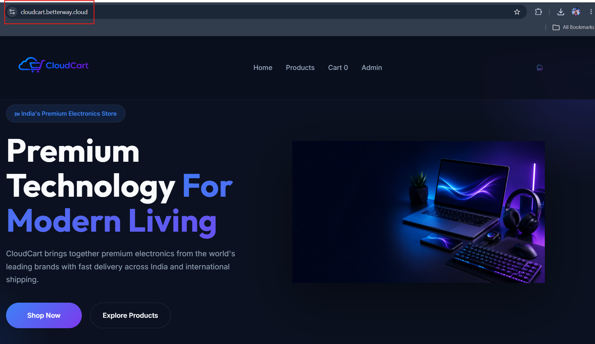
</a>

### ▶️ Watch the CloudCart Production Demo

**https://cloudcart.betterway.cloud**

*Click the image to watch the demonstration.*

</div>

> **Note**
>
> The AWS infrastructure is intentionally destroyed after demonstrations to optimize cloud costs. The recorded walkthrough showcases the deployed production environment.

---

# 🏗️ AWS Architecture Diagram

The following architecture illustrates the complete production deployment implemented in this repository.

<div align="center">

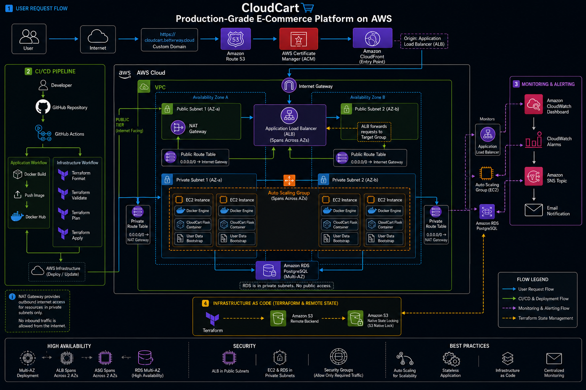

</div>

The architecture includes:

- Amazon Route 53
- AWS Certificate Manager (ACM)
- Amazon CloudFront
- Amazon VPC
- Public & Private Subnets
- Internet Gateway
- NAT Gateway
- Application Load Balancer
- Auto Scaling Group
- Amazon EC2
- Docker
- Amazon RDS PostgreSQL
- Amazon CloudWatch
- Amazon SNS
- Terraform Remote Backend
- GitHub Actions CI/CD

---

# ✨ Project Highlights

## 🚀 Production-Oriented Infrastructure

- Production-style AWS architecture
- Infrastructure provisioned using Terraform
- Modular Terraform design
- Remote Terraform state management
- Automated infrastructure deployment
- Infrastructure lifecycle automation
- Production-ready networking

---

## ☁️ AWS Cloud Services

- Amazon VPC
- Public & Private Subnets
- Internet Gateway
- NAT Gateway
- Application Load Balancer
- Auto Scaling Group
- Amazon EC2
- Amazon RDS PostgreSQL
- Amazon CloudFront
- Amazon Route 53
- AWS Certificate Manager (ACM)
- Amazon CloudWatch
- Amazon SNS

---

## ⚙️ Infrastructure as Code

- Modular Terraform architecture
- Reusable Terraform modules
- Environment configuration
- Variables and outputs
- Remote backend
- State locking
- Production-ready project structure

---

## 🐳 Containerization

- Dockerized Flask application
- Production Docker image
- Automated container deployment
- EC2 User Data bootstrap automation

---

## 🔄 CI/CD Automation

GitHub Actions automates:

- Infrastructure validation
- Infrastructure deployment
- Infrastructure destruction
- Application deployment

---

## 📊 Monitoring

- CloudWatch Dashboard
- CloudWatch Alarms
- SNS Email Notifications
- Infrastructure monitoring
- Resource health monitoring

---

## 🔒 Security

- Private application infrastructure
- Security Groups
- HTTPS using ACM
- CloudFront edge delivery
- Route 53 DNS management
- IAM Roles
- Least-privilege access

---

# 🛒 CloudCart Application

This repository contains two major components:

| Component                 | Description                                               |
| ------------------------- | --------------------------------------------------------- |
| **AWS Infrastructure**    | Production-grade AWS infrastructure built using Terraform |
| **CloudCart Application** | Modern Flask-based e-commerce web application             |

The complete application source code, frontend implementation, UI walkthroughs, application architecture, features, and screenshots are documented separately.

## 📚 Application Documentation

➡️ **See the complete CloudCart application documentation here:**

**[`cloudcart/README.md`](cloudcart/README.md)**

That documentation includes:

- Application Overview
- Features
- UI Components
- Project Structure
- Docker Configuration
- Frontend Screenshots
- Flask Application Details

This root README focuses primarily on the AWS infrastructure and deployment architecture.

---

# 🛠️ Technology Stack

## Cloud Platform

- Amazon Web Services (AWS)

## Infrastructure as Code

- Terraform

## Containerization

- Docker

## Backend

- Python
- Flask

## Database

- Amazon RDS PostgreSQL

## Networking

- Amazon VPC
- Route 53
- CloudFront
- Application Load Balancer

## CI/CD

- GitHub Actions

## Monitoring

- Amazon CloudWatch
- Amazon SNS

## Version Control

- Git
- GitHub

---

---

# 🏛️ Architecture Overview

CloudCart follows a production-oriented AWS architecture designed with scalability, high availability, security, automation, and operational excellence in mind.

The infrastructure separates networking, compute, storage, monitoring, and deployment into independent layers, allowing each component to scale and operate independently.

## High-Level Architecture

```text
                        Internet
                            │
                            ▼
                  Amazon Route 53 (DNS)
                            │
                            ▼
               AWS Certificate Manager (SSL)
                            │
                            ▼
                 Amazon CloudFront (CDN)
                            │
                            ▼
              Application Load Balancer (ALB)
                            │
                            ▼
              Auto Scaling Group (EC2 Instances)
                            │
                 Dockerized Flask Application
                            │
                            ▼
                 Amazon RDS PostgreSQL
```

Infrastructure provisioning and lifecycle management are fully automated using Terraform, while GitHub Actions manages Continuous Integration and Continuous Deployment (CI/CD).

Monitoring and operational visibility are provided through Amazon CloudWatch and Amazon SNS.

---

# 📂 Repository Structure

```text
.
├── .github/
│   └── workflows/
│       ├── application.yaml
│       ├── deployment.yaml
│       ├── destroy.yaml
│       └── infrastructure.yaml
│
├── assets/
│   ├── logo/
│   ├── cloudcart-production-architecture-diagram.png
│   └── screenshots/
│       ├── manual-deployment/
│       └── terraform/
│
├── cloudcart/
│   ├── assets/
│   ├── static/
│   ├── templates/
│   ├── app.py
│   ├── Dockerfile
│   ├── requirements.txt
│   └── README.md
│
├── terraform/
│   ├── modules/
│   ├── scripts/
│   ├── backend.tf
│   ├── providers.tf
│   ├── variables.tf
│   ├── outputs.tf
│   ├── main.tf
│   └── versions.tf
│
├── .gitignore
└── README.md
```

---

# ☁️ AWS Infrastructure Overview

The infrastructure is composed of production-ready AWS services that work together to provide a secure, scalable, and resilient deployment platform.

| AWS Service               | Purpose                                               |
| ------------------------- | ----------------------------------------------------- |
| Amazon VPC                | Isolated networking environment                       |
| Public & Private Subnets  | Separation of public and private resources            |
| Internet Gateway          | Internet access for public resources                  |
| NAT Gateway               | Secure outbound internet access for private resources |
| Security Groups           | Instance and database firewall rules                  |
| IAM Roles                 | Secure AWS service permissions                        |
| EC2 Launch Template       | Standardized EC2 instance configuration               |
| Auto Scaling Group        | Automatic instance provisioning and scaling           |
| Application Load Balancer | Traffic distribution across EC2 instances             |
| Amazon EC2                | Hosts the Dockerized CloudCart application            |
| Amazon RDS PostgreSQL     | Managed relational database                           |
| Amazon Route 53           | DNS management                                        |
| AWS Certificate Manager   | SSL/TLS certificate management                        |
| Amazon CloudFront         | Global content delivery network                       |
| Amazon CloudWatch         | Infrastructure monitoring                             |
| Amazon SNS                | Email alert notifications                             |

---

# 🏗️ Terraform Module Structure

The infrastructure follows a modular Terraform architecture to improve maintainability, scalability, and code reusability.

## Modules

| Module            | Responsibility                                            |
| ----------------- | --------------------------------------------------------- |
| `vpc`             | VPC, subnets, route tables, Internet Gateway, NAT Gateway |
| `security-groups` | Security groups for ALB, EC2, and RDS                     |
| `iam`             | IAM roles and EC2 instance profile                        |
| `launch-template` | EC2 launch template and bootstrap configuration           |
| `autoscaling`     | Auto Scaling Group configuration                          |
| `alb`             | Application Load Balancer and target groups               |
| `rds`             | Amazon RDS PostgreSQL database                            |
| `route53`         | DNS records                                               |
| `acm`             | SSL/TLS certificate provisioning                          |
| `cloudfront`      | Global CDN configuration                                  |
| `cloudwatch`      | Dashboards and monitoring alarms                          |
| `sns`             | Notification topics and email subscriptions               |

Each module follows a consistent Terraform structure:

```text
module-name/
├── locals.tf
├── main.tf
├── outputs.tf
└── variables.tf
```

This modular approach enables:

- Reusable infrastructure components
- Simplified maintenance
- Clear separation of responsibilities
- Easier troubleshooting
- Improved scalability
- Better collaboration

---

# ⚙️ Terraform Project Structure

The root Terraform configuration contains the shared infrastructure configuration responsible for orchestrating all modules.

| File                       | Purpose                                    |
| -------------------------- | ------------------------------------------ |
| `backend.tf`               | Remote backend configuration               |
| `providers.tf`             | AWS provider configuration                 |
| `versions.tf`              | Terraform and provider version constraints |
| `variables.tf`             | Input variable definitions                 |
| `terraform.tfvars.example` | Example environment variables              |
| `locals.tf`                | Local reusable values                      |
| `main.tf`                  | Root module orchestration                  |
| `outputs.tf`               | Infrastructure outputs                     |

The project uses:

- Modular Infrastructure as Code
- Remote Terraform state
- Native S3 state locking
- Environment-based variables
- Centralized outputs
- Reusable Terraform modules

---

# 🚀 GitHub Actions CI/CD

CloudCart uses GitHub Actions to automate infrastructure provisioning, application deployment, and infrastructure lifecycle management.

## Workflow Overview

| Workflow              | Purpose                                                      |
| --------------------- | ------------------------------------------------------------ |
| `application.yaml`    | Builds and deploys the Dockerized CloudCart application      |
| `infrastructure.yaml` | Validates Terraform configuration and infrastructure         |
| `deployment.yaml`     | Manually provisions AWS infrastructure using Terraform       |
| `destroy.yaml`        | Manually destroys AWS infrastructure to optimize cloud costs |

## CI/CD Pipeline

```text
Developer
      │
      ▼
GitHub Repository
      │
      ▼
GitHub Actions
      │
      ├──────── Validate Terraform
      │
      ├──────── Build Docker Image
      │
      ├──────── Push Docker Image
      │
      ├──────── Terraform Apply
      │
      └──────── Terraform Destroy
```

The workflows use GitHub Secrets and Repository Variables to securely manage AWS credentials, Docker Hub credentials, and environment-specific configuration without exposing sensitive information in source control.

---

---

# 📊 Monitoring & Alerting

CloudCart includes centralized monitoring and alerting to provide operational visibility into the deployed infrastructure.

Amazon CloudWatch continuously monitors infrastructure health, while Amazon SNS delivers email notifications whenever configured alarm thresholds are reached.

## Monitoring Components

| Service                     | Purpose                              |
| --------------------------- | ------------------------------------ |
| Amazon CloudWatch Dashboard | Centralized infrastructure dashboard |
| CloudWatch Alarms           | Automated resource monitoring        |
| Amazon SNS                  | Email notification service           |

## Monitored Resources

- Application Load Balancer
- Amazon EC2
- Amazon RDS PostgreSQL

## Alerting Workflow

```text
AWS Resources
       │
       ▼
Amazon CloudWatch
       │
CloudWatch Alarms
       │
       ▼
Amazon SNS
       │
       ▼
Email Notifications
```

Monitoring helps identify potential infrastructure issues before they impact application availability.

---

# 🚀 Deployment Workflow

CloudCart follows a production-style deployment workflow that combines Infrastructure as Code, containerization, and CI/CD automation.

## Infrastructure Deployment

```text
Developer
      │
      ▼
GitHub Repository
      │
      ▼
GitHub Actions
      │
      ▼
Terraform
      │
      ▼
AWS Infrastructure
```

Terraform provisions all AWS resources required for the application.

---

## Application Deployment

```text
Developer
      │
      ▼
GitHub Repository
      │
      ▼
GitHub Actions
      │
      ▼
Docker Build
      │
      ▼
Docker Hub
      │
      ▼
Amazon EC2
      │
      ▼
CloudCart Application
```

The application is deployed as a Docker container running on Amazon EC2 instances managed by an Auto Scaling Group.

---

# 📸 Manual AWS Deployment

Before implementing Infrastructure as Code, the complete production infrastructure was manually deployed through the AWS Management Console.

This phase provided practical experience with AWS networking, compute, security, storage, and application deployment.

## Manual Deployment Screenshots

| Screenshot                                                                      | Description                                |
| ------------------------------------------------------------------------------- | ------------------------------------------ |
| 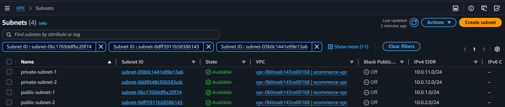                    | Custom VPC with public and private subnets |
| 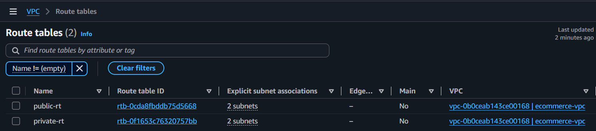                   | Route table configuration                  |
| 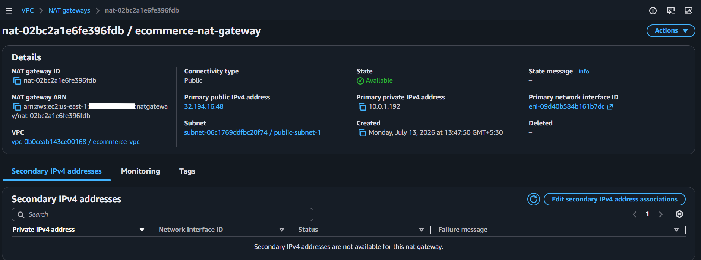               | Network architecture                       |
| 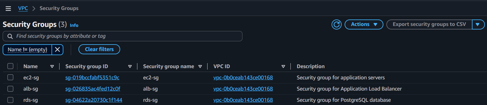                | Security group configuration               |
| 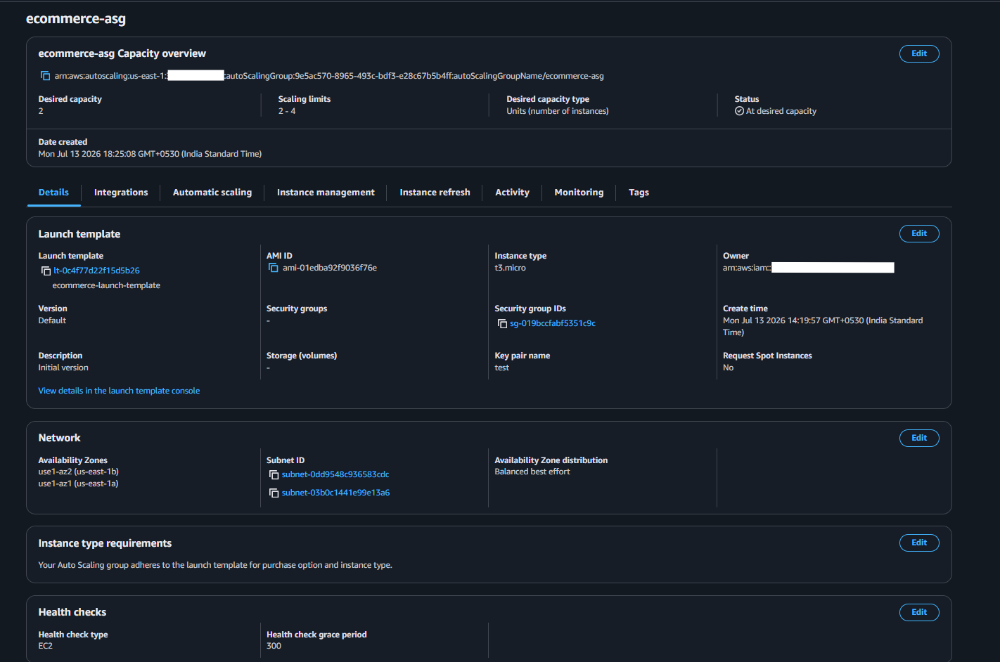             | Auto Scaling Group configuration           |
| 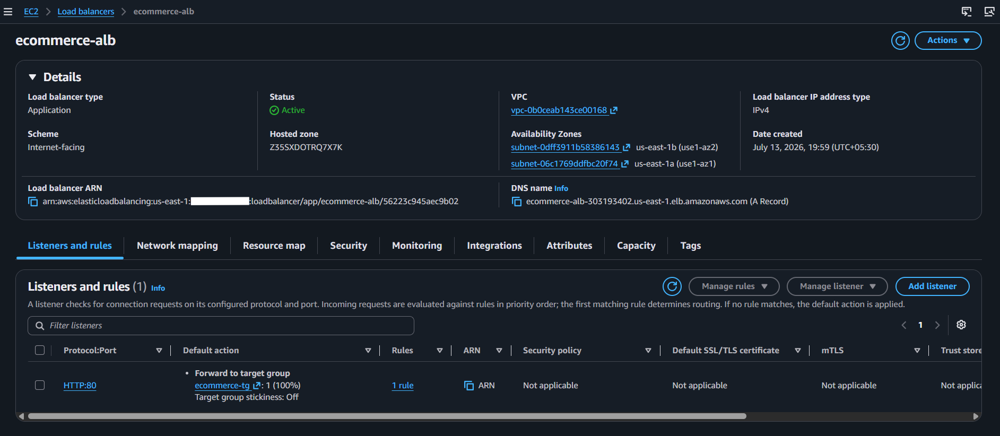      | Application Load Balancer                  |
| 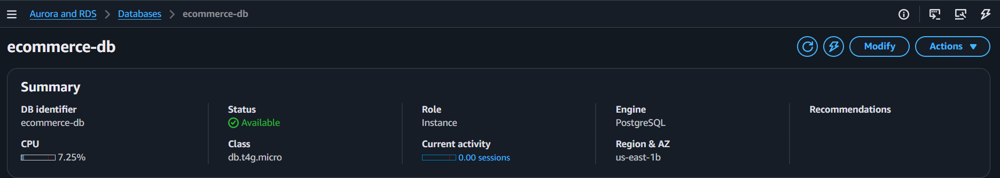                 | Amazon RDS PostgreSQL                      |
| 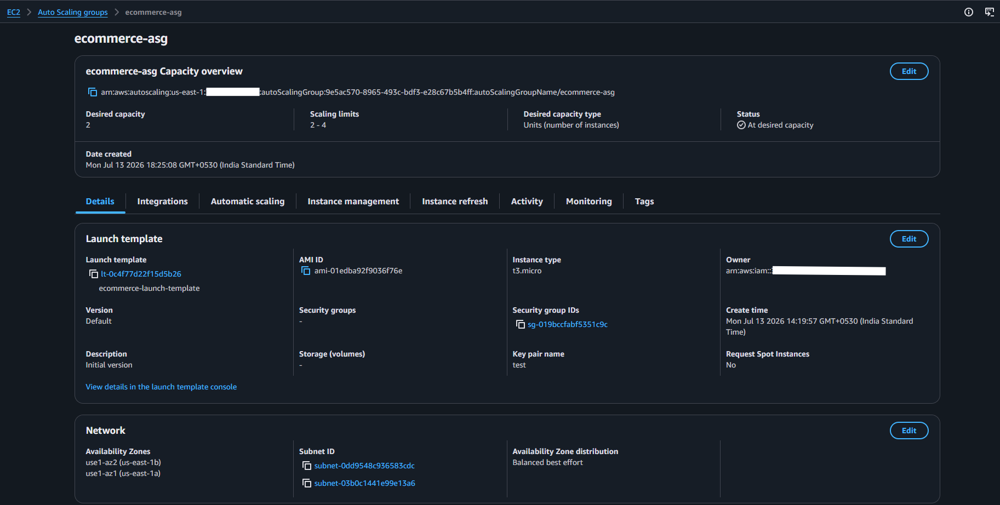     | Running EC2 instances                      |
| 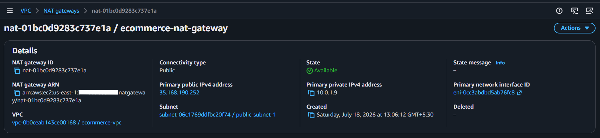            | NAT Gateway                                |
| 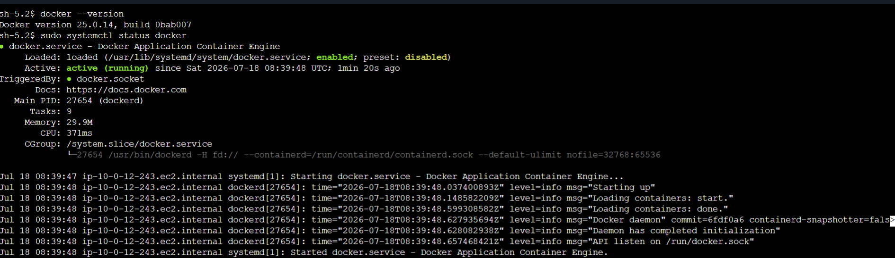        | Docker installed on EC2                    |
| 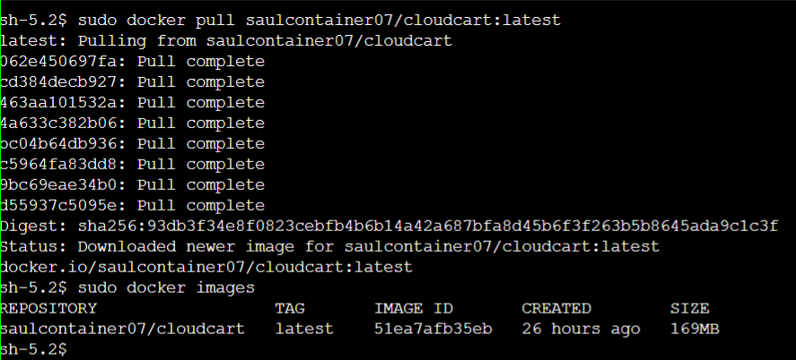            | Docker image deployment                    |
| 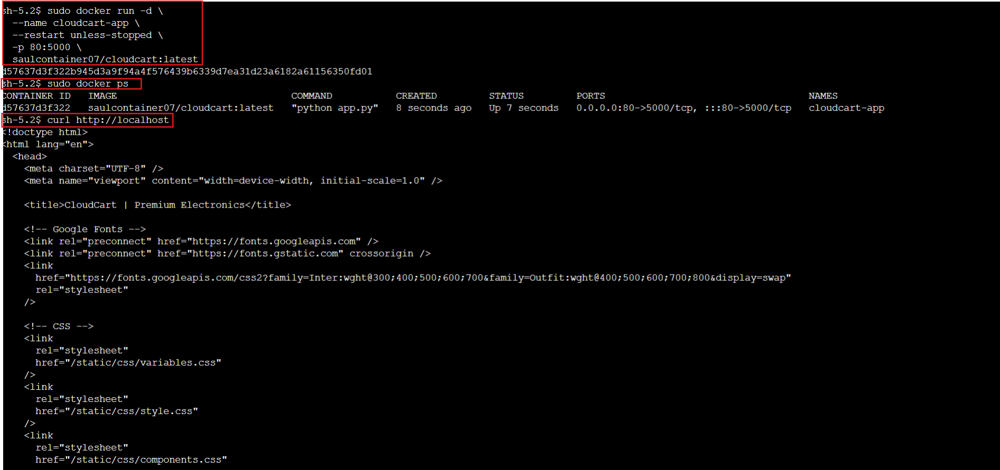    | Running CloudCart container                |
| 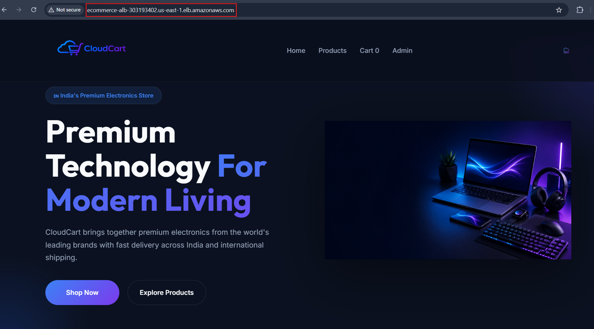 | Application behind ALB                     |
| 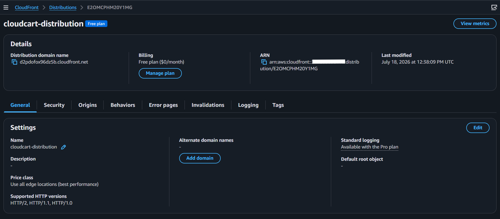        | CloudFront distribution                    |
| 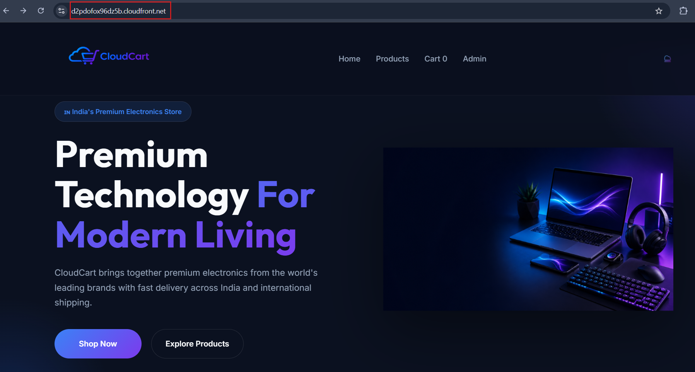   | Final application through CloudFront       |

---

# 🌍 Terraform Infrastructure Deployment

After validating the architecture manually, the complete infrastructure was recreated using modular Terraform configurations.

Every AWS resource is provisioned through Infrastructure as Code, enabling repeatable, version-controlled, and automated deployments.

## Terraform Deployment Screenshots

| Screenshot                                                          | Description                                    |
| ------------------------------------------------------------------- | ---------------------------------------------- |
| 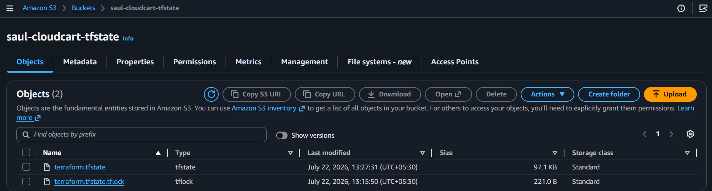             | Terraform remote backend                       |
| 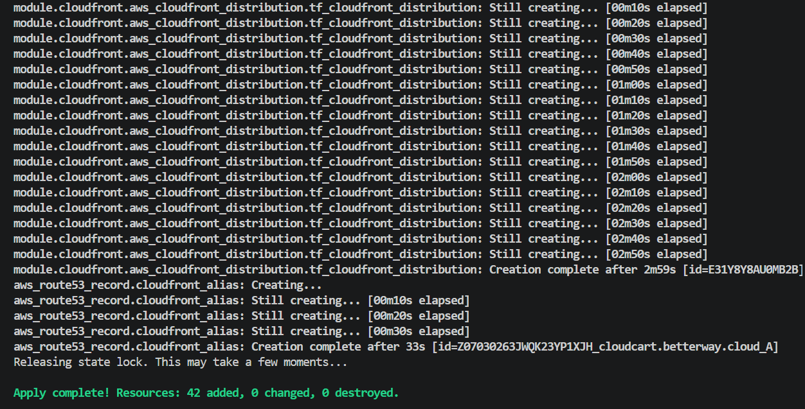       | Successful Terraform deployment                |
| 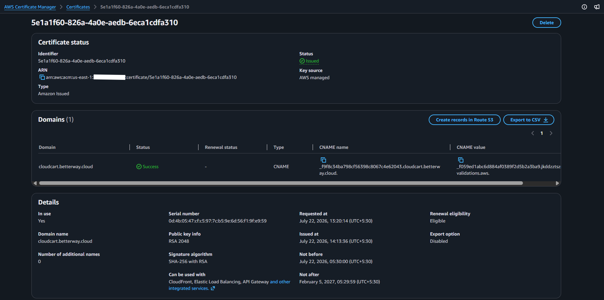        | ACM certificate                                |
| 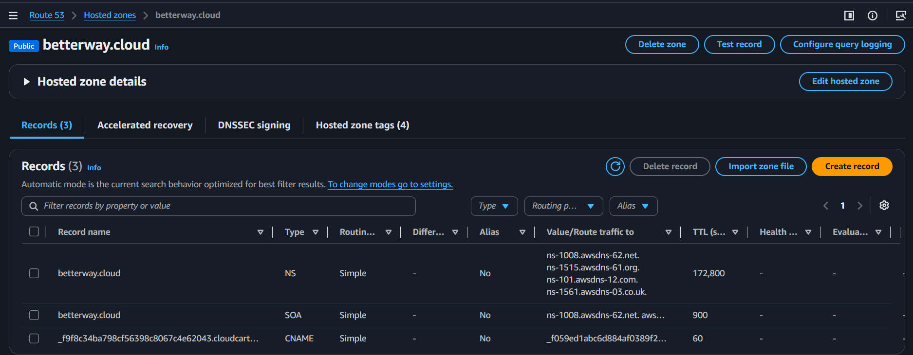           | Route 53 hosted zone                           |
| 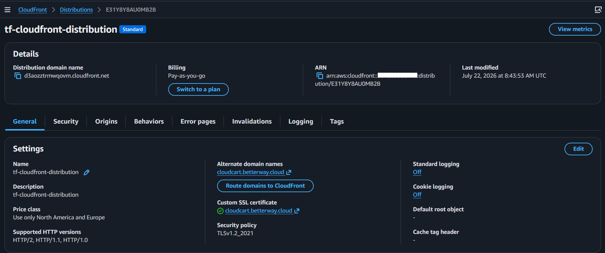       | CloudFront distribution                        |
| 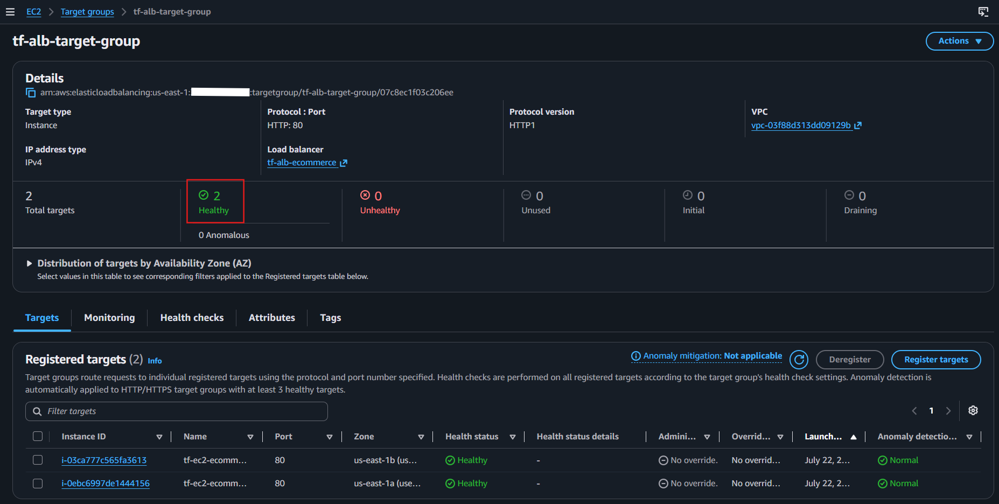      | Healthy Application Load Balancer target group |
|  | Production application                         |
| 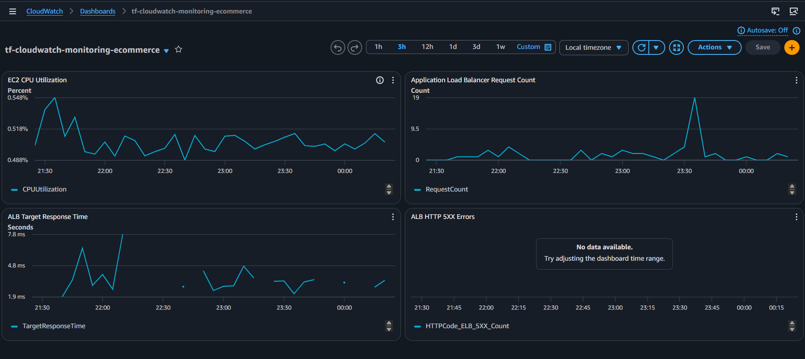          | CloudWatch dashboard                           |
| 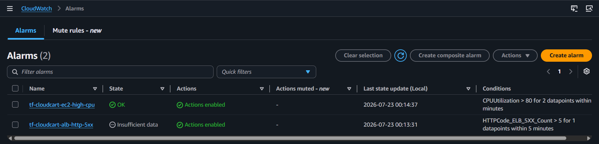             | CloudWatch alarms                              |
| 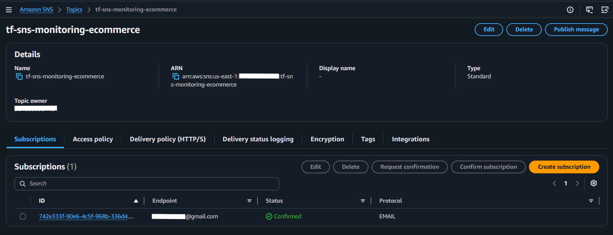                     | SNS topic                                      |
| 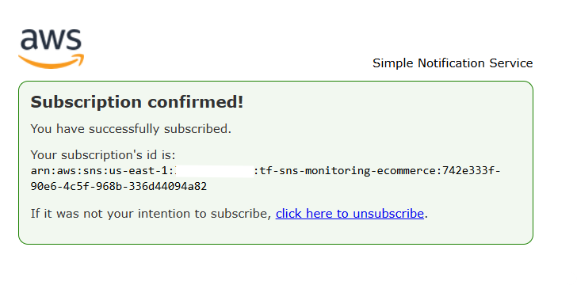    | SNS email subscription                         |

---

# 📚 Application Documentation

This repository focuses primarily on AWS infrastructure and deployment.

The complete CloudCart application has its own dedicated documentation.

## CloudCart Application

📖 **Documentation**

[cloudcart/README.md](/cloudcart/README.md)

The application README includes:

- Application overview
- Flask architecture
- Features
- UI walkthrough
- Project structure
- Docker configuration
- Frontend screenshots
- Application components

Keeping the application documentation separate allows this root README to remain focused on AWS infrastructure, Terraform, CI/CD, and cloud architecture.

---

# 💡 Key Features

- Production-grade AWS architecture
- Infrastructure as Code with Terraform
- Modular Terraform modules
- Dockerized Flask application
- GitHub Actions CI/CD pipelines
- Remote Terraform backend
- Native S3 state locking
- CloudFront global content delivery
- Auto Scaling Group
- Application Load Balancer
- Amazon RDS PostgreSQL
- Route 53 DNS management
- HTTPS with AWS Certificate Manager
- CloudWatch monitoring
- SNS email notifications
- Infrastructure lifecycle automation
- Production-ready repository structure

---

---

# 🎯 Learning Outcomes

This project provided practical experience in designing, deploying, automating, and managing a production-style AWS cloud infrastructure using industry-standard tools and best practices.

Throughout the implementation, the following skills were developed:

## Amazon Web Services (AWS)

- Designed a production-style AWS architecture
- Built a secure Virtual Private Cloud (VPC)
- Configured public and private subnets
- Implemented Internet Gateway and NAT Gateway
- Configured Security Groups following least-privilege principles
- Deployed Dockerized applications on Amazon EC2
- Implemented Auto Scaling Group for high availability
- Configured an Application Load Balancer
- Provisioned Amazon RDS PostgreSQL
- Configured Amazon Route 53 DNS
- Secured the application using AWS Certificate Manager (ACM)
- Distributed traffic globally using Amazon CloudFront
- Implemented CloudWatch monitoring and dashboards
- Configured Amazon SNS email notifications

---

## Terraform

- Built reusable Terraform modules
- Implemented modular Infrastructure as Code
- Managed remote Terraform state
- Configured native S3 state locking
- Used variables, locals, outputs, and reusable modules
- Automated complete infrastructure provisioning
- Automated infrastructure destruction
- Followed Terraform best practices

---

## Docker

- Containerized a Flask application
- Created a production-ready Docker image
- Deployed containers on Amazon EC2
- Automated container deployment using EC2 User Data

---

## GitHub Actions

- Automated Terraform validation
- Automated application deployment
- Automated infrastructure deployment
- Automated infrastructure destruction
- Managed GitHub Secrets securely
- Used Repository Variables for configuration

---

## DevOps Practices

- Infrastructure as Code (IaC)
- Version Control with Git
- Continuous Integration (CI)
- Continuous Deployment (CD)
- Infrastructure Automation
- Monitoring and Alerting
- Documentation
- Production Deployment Workflow

---

# 🚀 Future Enhancements

Potential improvements that could further extend this project include:

- AWS Web Application Firewall (AWS WAF)
- Amazon ElastiCache for caching
- Amazon Elastic Container Registry (ECR)
- Amazon ECS or Amazon EKS deployment
- Blue/Green deployment strategy
- Canary deployments
- Multi-Region disaster recovery
- Automated database backups
- AWS Secrets Manager integration
- AWS Systems Manager Parameter Store
- Centralized logging using CloudWatch Logs
- Cost optimization dashboards
- Performance testing automation
- Infrastructure security scanning
- Automated compliance validation

---

# 🧹 Cleanup

To avoid unnecessary AWS charges after demonstrations or testing:

- Destroy infrastructure using the `destroy.yaml` GitHub Actions workflow.
- Alternatively, run `terraform destroy` locally if managing the infrastructure manually.
- Verify that all AWS resources have been removed before concluding the cleanup process.

This project was intentionally designed so the complete infrastructure can be recreated at any time using Terraform.

---

# 📜 License

This project is licensed under the MIT License.

---

# 👨‍💻 Author

**Vaibhav Nalla**

AWS Certified Solutions Architect – Associate

Passionate about designing scalable, automated, and production-ready cloud infrastructure using AWS, Terraform, Docker, and DevOps best practices.

---

# 🙏 Acknowledgements

This project was inspired by real-world AWS architecture patterns and modern DevOps engineering practices.

Special thanks to the AWS documentation, Terraform community, and the open-source ecosystem for providing the tools and resources that make projects like this possible.

---

<div align="center">

## ⭐ If you found this project helpful, consider giving it a star!

**Thank you for visiting this repository.**

</div>